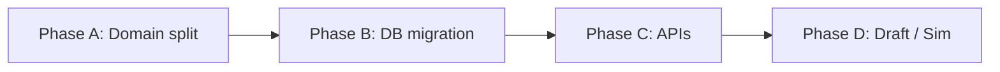

# Player → Card Migration Report

Generated during domain review before gameplay implementation.

## Executive Summary

| Metric                                                  | Value                                        |
| ------------------------------------------------------- | -------------------------------------------- |
| Files with direct `overall` / `overallSource` on Player | ~35                                          |
| Modules affected                                        | 6 critical, 4 medium                         |
| New module                                              | `cards`                                      |
| DB change                                               | New `cards` table; remove `players.overall*` |
| Breaking API                                            | Yes — `overallRating` leaves `PlayerSummary` |
| Gameplay blocked until                                  | Phase B data migration + card APIs           |

## Files Affected

### Players module (critical)

| File                                              | Change                                   |
| ------------------------------------------------- | ---------------------------------------- |
| `domain/entities/player.entity.ts`                | Remove overall fields and methods        |
| `domain/value-objects/overall-rating.vo.ts`       | Remove or relocate to `cards`            |
| `domain/enums/overall-source.enum.ts`             | Move to `cards` as `card-overall-source` |
| `infrastructure/mappers/player.mapper.ts`         | Drop overall columns                     |
| `application/use-cases/create-player.use-case.ts` | Identity-only create                     |
| `application/use-cases/update-player.use-case.ts` | Remove overall update                    |
| `presentation/dto/create-player.dto.ts`           | Remove `overallRating`                   |
| `presentation/dto/update-player.dto.ts`           | Remove `overallRating`                   |
| `presentation/mappers/player-response.mapper.ts`  | Drop overall from response               |
| `testing/player-test.factory.ts`                  | Identity-only factory                    |
| All `*.unit.test.ts` in players                   | Update assertions                        |

### Data providers (high)

| File                                                      | Change                                 |
| --------------------------------------------------------- | -------------------------------------- |
| `application/policies/import-overall.policy.ts`           | **Remove** from import path            |
| `application/mappers/external-player-to-player.mapper.ts` | Remove overall context                 |
| `application/use-cases/import-player.use-case.ts`         | Identity-only upsert                   |
| `presentation/mappers/admin-import-response.mapper.ts`    | Remove `overallRating` from import DTO |

### Cards module (new)

| File                      | Status               |
| ------------------------- | -------------------- |
| `cards/domain/**`         | **Created**          |
| `cards/infrastructure/**` | Stub until migration |
| `cards/application/**`    | Placeholder          |
| `cards/presentation/**`   | Placeholder          |

### Overall engine (medium)

| File                            | Change                                    |
| ------------------------------- | ----------------------------------------- |
| `overall-calculation-result.ts` | Target `Card`, not `Player` (future wire) |
| `stub-overall-calculator.ts`    | Document card output contract             |

### Teams (medium — documentation + future)

| File                                         | Change                            |
| -------------------------------------------- | --------------------------------- |
| `domain/value-objects/starting-eleven.vo.ts` | Document: slots hold **card IDs** |
| `domain/entities/team.entity.ts`             | No code change this sprint        |

### Shared types (medium)

| File                        | Change                                  |
| --------------------------- | --------------------------------------- |
| `players/player-summary.ts` | Remove `overallRating`, `overallSource` |
| `admin/imports.ts`          | Remove import overall fields            |
| `cards/card-summary.ts`     | **New**                                 |

### Prisma (high)

| File                   | Change                                                     |
| ---------------------- | ---------------------------------------------------------- |
| `prisma/schema.prisma` | Add `Card` model; Player loses `overall*`; add `birthDate` |

### Tests (high)

| Area                                                 | Count                |
| ---------------------------------------------------- | -------------------- |
| Player unit tests                                    | ~12 files            |
| Import unit tests                                    | ~5 files             |
| E2E `players.e2e.test.ts`                            | Update CRUD payloads |
| E2E `admin-imports.e2e.test.ts`                      | Update mocks         |
| Integration `players.repository.integration.test.ts` | Update schema fields |

### Documentation (complete this sprint)

- `docs/architecture/player-card-separation.md`
- `docs/architecture/card-domain-overview.md`
- `docs/game-design/card-system.md`
- `docs/game-design/draft-system.md` (updated)
- `docs/game-design/match-simulation.md` (updated)

## Modules Affected

| Module                | Complexity                       | Notes                          |
| --------------------- | -------------------------------- | ------------------------------ |
| `players`             | **High**                         | Core aggregate slim-down       |
| `cards`               | **High**                         | New bounded context            |
| `data-providers`      | **Medium**                       | Import stops creating strength |
| `overall-engine`      | **Medium**                       | Retarget to cards (later wire) |
| `teams`               | **Low** (now) / **High** (draft) | startingEleven semantics       |
| `shared-types`        | **Medium**                       | Contract split                 |
| `frontend`            | **Low**                          | Thin admin client              |
| `draft`, `simulation` | **N/A**                          | Not implemented; docs only     |

## Migration Complexity

| Phase | Risk                     | Mitigation                                |
| ----- | ------------------------ | ----------------------------------------- |
| A     | Broken tests, API breaks | Full test suite; version API later        |
| B     | Data loss on overall     | Backfill script: one BASE card per player |
| C     | Admin workflow gap       | Manual card create API before draft       |
| D     | Wrong ID type in teams   | Migration script for starting_eleven JSON |

## Incorrect Gameplay Dependencies on Player (today)

| Consumer                       | Issue                                   | Fix                           |
| ------------------------------ | --------------------------------------- | ----------------------------- |
| `PlayerSummary.overallRating`  | Public API exposes strength on identity | Move to `CardSummary`         |
| `CreatePlayerUseCase`          | Requires overall on create              | Card create use case (future) |
| `ImportPlayerUseCase` + policy | Assigns overall at import               | Identity-only import          |
| `match-simulation.md`          | References `Player.overallRating`       | **Updated** → Card            |
| `draft-system.md`              | Pool of "players"                       | **Updated** → Cards           |
| `Team.startingEleven`          | Player ID slots                         | Document → Card IDs           |
| `OverallEngine` (future)       | Designed to update Player               | Update Card                   |

## Recommended Sequence (next sprints)

### Sprint 1 (current) — Architecture prep ✅

- [x] Domain review and documentation
- [x] `cards` module domain layer + tests
- [x] Remove overall from `Player` domain
- [x] Prisma proposal (no auto-migrate)
- [x] Import pipeline identity-only

### Sprint 2 — Persistence & API

- Run migration + backfill BASE cards
- `PrismaCardRepository` + card list/get APIs
- `CreateCardUseCase` (manual admin)
- Split frontend types

### Sprint 3 — Overall engine

- Wire calculator → card update
- Recalculate card overall batch job

### Sprint 4 — Draft foundation

- Card pool generation
- Draft picks card IDs
- Team squad holds card IDs

## Migration Risks

1. **Empty draft pool** — No cards until admin/engine creates them after import.
2. **Breaking REST clients** — `overallRating` removed from player endpoints.
3. **Dual-write period** — If migration delayed, domain and DB may diverge; do not deploy domain without migration plan.
4. **Position ownership** — Positions stay on Player (provider default); future OOP penalties may copy to card.
5. **startingEleven migration** — Existing JSON uses player IDs; needs one-time transform after cards exist.
