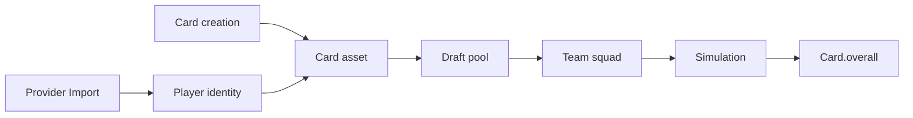

# Card System

## Player vs Card

|                    | Player          | Card                 |
| ------------------ | --------------- | -------------------- |
| Represents         | Real footballer | Playable collectible |
| Created by import  | Yes             | **No**               |
| Owns overall       | **No**          | **Yes**              |
| Owns rarity / type | **No**          | Via reference FKs    |
| Owns visuals       | **No**          | Via `CardTemplate`   |
| Used in draft      | **No**          | **Yes**              |
| Used in simulation | **No**          | **Yes**              |

### Player owns (identity)

Name, birth date, positions, nationality, provider IDs, affiliation mirror (`teamId`, market value).

### Player does NOT own

Overall, rarity, card type, template, chemistry bonuses, gameplay modifiers.

## Card Editions

Types are **database records**, not code enums. Examples:

| Code         | Example card               |
| ------------ | -------------------------- |
| `BASE`       | Messi Base 89              |
| `HERO`       | Hero Messi                 |
| `ICON`       | Icon Messi                 |
| `PRIME_ICON` | Prime Icon Messi 99        |
| `TOTY`       | (future — insert row only) |
| `WORLD_CUP`  | (future event)             |

Same player, many cards:

```
Lionel Messi (Player)
├── Messi Base      overall 89
├── Messi TOTY      overall 98
└── Messi Prime Icon overall 99
```

## Rarity

Database-driven tiers: `COMMON`, `RARE`, `EPIC`, `LEGENDARY` (+ future via insert).

Rarity affects packs and UI — simulation uses `overall`.

## Templates

Visual frame/art config on `CardTemplate` — linked by `cardTemplateId`.

Backend does not render cards; clients use template keys and asset URLs.

## How Gameplay Will Consume Cards



1. **Import** — creates `Player` only
2. **Card creation** (future admin/engine) — attaches editions
3. **Draft** — picks `cardId` from pool (filter by type/rarity/overall)
4. **Team** — `startingEleven` stores card UUIDs
5. **Simulation** — loads cards, uses `overall` per slot

## Out of Scope

Pack opening, economy, chemistry, overall calculation, card auto-generation on import.

## API (read foundation)

- `GET /api/v1/cards?cardType=TOTY&minOverall=90`
- `GET /api/v1/cards/:id`
- `GET /api/v1/players/:playerId/cards`
